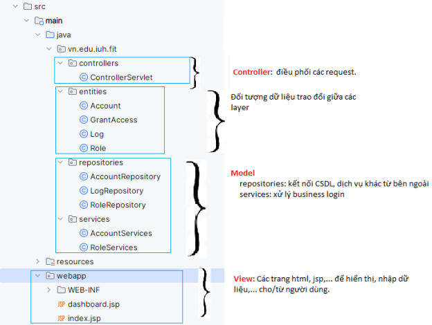
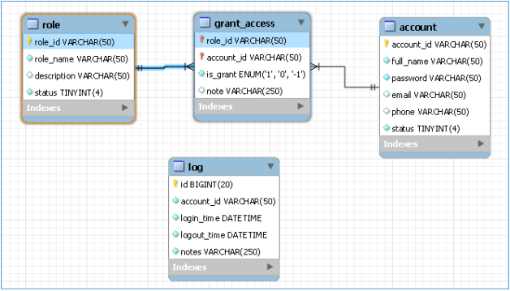

# week01_lab_VoTanDat_20116031

### Information:

Name: Võ Tấn Đạt
ID: 20116031
Subject: Lập trình WWW với công nghệ JAVA

### Description:

Bài tập lab01 week1

## 1. Kiến trúc dự án

- Mô hình MVC

## 2. Cơ sở dữ liệu

## 3. Chức năng

- Thêm, cập nhật, xóa ở các đối tượng đã cho
- Đăng nhập
- Hiển thị thông tin tài khoản (nếu đăng nhập thành công)
- Hiển thị các quyền của một account.
- Hiển thị các account của một role
- Cấp quyền cho một account
- Ghi log mỗi lần account đăng nhập, đăng xuất.

## 4. Cách chạy dự án

- Clone dự án tại link này
- Mở dự án bằng IntelliJ
- Chọn services là Tomcat
- Bấm build để chạy dự án
- Mở trình duyện và xem dự án tại http://localhost:8080

## 5. Các công cụ đã sử dụng

- IDE : IntelliJ
- Web server : Tomcat
- Database server : MySQL
- Container : Docker (sử dụng docker để chạy MySQL)
- Storage code: GitHub

## 6. Lời cảm ơn

Cảm ơn bạn đã ghé thăm dự án của tôi <3
